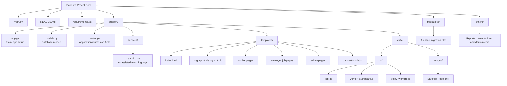

# SafeHire - AI Powered Service Hiring Platform

SafeHire is a secure and intelligent web-based service hiring platform designed to connect employers with verified workers. The platform supports structured worker registration, AI-assisted job matching, worker verification, transparent hiring transactions, payment completion, and review-based trust building.

## Project Type

CSE299 - Junior Design Project

## Project Overview

Traditional service hiring often faces problems such as:

- Lack of worker verification
- Risk of fraud or identity issues
- Limited trust between employers and workers
- Difficulty finding suitable workers quickly
- No transparent hiring or transaction records

SafeHire addresses these issues through a role-based web platform for workers, employers, and admins. Workers can create profiles and apply for matched jobs, employers can post jobs and hire verified workers, and admins can monitor workers, employers, reviews, and transactions.

## Key Features

### Authentication and Roles

- User signup and login system
- Role-based access for workers, employers, and admins
- Separate admin login
- Protected dashboards based on user role

### Worker Features

- Worker profile creation
- Worker profile update
- Skill, profession, experience, NID, phone, and address management
- AI-assisted matched job recommendations
- Job application system
- Worker dashboard with assigned jobs, reviews, and earnings

### Employer Features

- Job posting system
- Employer job dashboard
- View job applicants
- AI-assisted worker matching
- Hire verified workers
- Complete payment for assigned work
- Submit reviews and ratings after completed transactions

### Admin Features

- Admin dashboard with platform statistics
- Worker verification management
- Employer monitoring
- Review monitoring
- Transaction visibility
- Worker status update: Pending, Verified, or Rejected

### AI-Assisted Matching

SafeHire includes a rule-based AI-assisted matching system that calculates worker-job match scores using:

- Worker profession
- Worker skills
- Job title
- Job category
- Job description
- Location relevance
- Worker experience
- Worker rating

### Hiring and Transaction Workflow

- Employers post jobs
- Workers apply to relevant jobs
- Employers view applicants and suggested matches
- Employers hire verified workers
- A hiring transaction is created
- Payment can be marked as completed
- Completed jobs can receive reviews and ratings

## Technologies Used

### Backend

- Python 3
- Flask
- Flask-SQLAlchemy
- Flask-Migrate
- Flask-Login
- Flask-CORS

### Database

- SQLite

### Frontend

- HTML
- CSS
- Tailwind CSS
- JavaScript
- Fetch API

## Project Structure



## How to Run the Project

### 1. Clone the Repository

```bash
git clone https://github.com/diyanazia/SafeHire-An_AI_Powered_Service_Hiring_Platform.git
```

### 2. Go to the Project Directory

```bash
cd SafeHire-An_AI_Powered_Service_Hiring_Platform
```

### 3. Create a Virtual Environment

```bash
python -m venv venv
```

### 4. Activate the Virtual Environment

For Windows:

```bash
venv\Scripts\activate
```

### 5. Install Dependencies

```bash
python -m pip install -r requirements.txt
```

### 6. Run the Project

```bash
python main.py
```

### 7. Open in Browser

```text
http://127.0.0.1:5000
```

## Important Routes

| Route | Description |
| --- | --- |
| `/` | Home page |
| `/signup` | User registration |
| `/login` | User login |
| `/admin-login` | Admin login |
| `/worker-dashboard` | Worker dashboard |
| `/add-worker` | Worker profile creation page |
| `/update-worker` | Worker profile update page |
| `/jobs` | Employer job dashboard |
| `/post-job` | Job posting page |
| `/transactions` | Transaction history page |
| `/admin-dashboard` | Admin dashboard |
| `/admin-workers` | Worker verification management |
| `/admin-employers` | Employer monitoring |
| `/admin-reviews` | Review monitoring |

## API Endpoints

| Endpoint | Method | Description |
| --- | --- | --- |
| `/add_worker` | POST | Create worker profile |
| `/update_worker` | POST | Update worker profile |
| `/workers` | GET | Get all workers for admin |
| `/verify_worker/<worker_id>` | POST | Update worker verification status |
| `/add_job` | POST | Create a new job |
| `/jobs_api` | GET | Get job list |
| `/worker_jobs` | GET | Get AI-matched jobs for worker |
| `/apply_job` | POST | Apply to a job |
| `/my_applications` | GET | View worker applications |
| `/job_applicants/<job_id>` | GET | View applicants for a job |
| `/job_matches` | GET | Get AI-assisted worker matches |
| `/hire` | POST | Hire a verified worker |
| `/transactions_api` | GET | Get transaction history |
| `/complete-payment/<transaction_id>` | POST | Complete payment |
| `/add_review` | POST | Submit review and rating |

## Admin Access

The project includes an admin creation route for project demonstration:

```text
/create-admins
```

This route creates the default admin accounts used during testing and demonstration.

## Contributing Members

- Nazia Faruque Diya
- Afridur Rahman Khan Mim

## Project Status

Final project submission version. Core features including authentication, worker verification, AI-assisted matching, job applications, hiring workflow, transactions, payment completion, and review/rating system are implemented.
